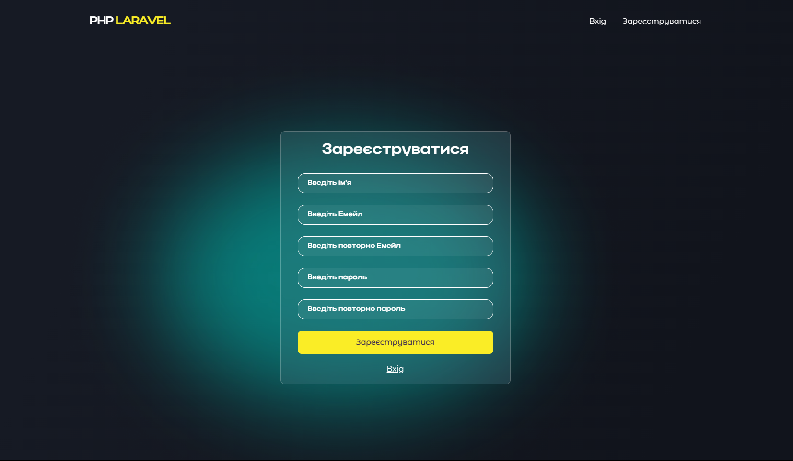
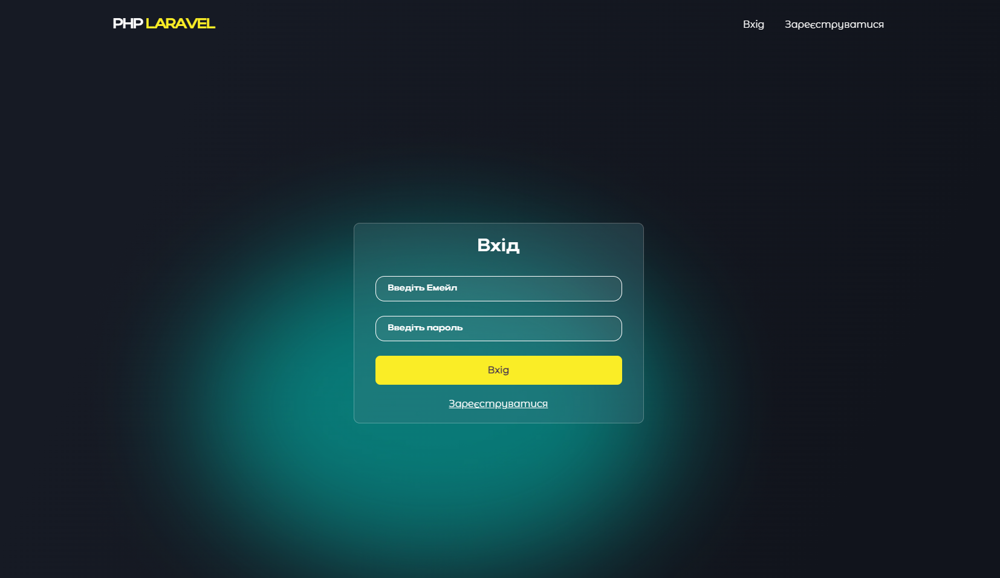
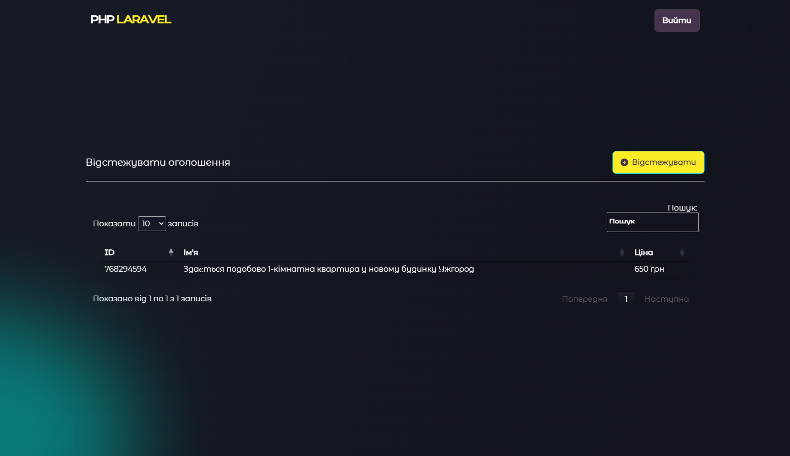

## Track The Price Of OLX

- [Опис](#description)
- [Сторінки](#pages)
- [Getting Started](#getting-started)

## Опис

  Вітаю, це маленький сервіс для відстежування цін на оголошення з сайту OLX. 

## Сторінки

Для того щоб їм користуватися, терба зареєструватися (тут проста форма  з введенням емейлу, им'ям та паролем)

  далі підтвердити свій емейл, і після цього сервісом можна користуватися.
  Або якщо ви вже зареєстрованні, то можна просто увійти.

  Після того як увійшли, або зареєструвалися, можна додати посилання на сторінку з об'явою, і сервіс далі буде слідкувати за зміненням ціни.

  

Якщо ціна змінилася, то на Ваш емейл який Ви вказали при реєстрації, буде відправленно лист, з посиланням на сторінку об'яви, та новою ціною.

## Getting Started

<h2>Version :</h2>
<ul>
    <li>
        
 LARAVEL  10

    </li>
    <li>
        
 PHP 8.2

    </li>
    <li>
        
 Docker  >= 4

    </li>
    <li>
        
 MySQL MariaDB - >= 10.8

    </li>
    <li>
        
 NPM  6.14.14

    </li>
    <li>
        
 NODE.JS  min 14.17.4
    

    </li>
</ul>

Качаємо архів. Розпаковуємо в папку, де буде знаходитись проект. Після запускаємо консоль, переходимо в папку з проектом і встановлюємо проект.
Або можна склонувати до себе.

<ul>
    <li>
        
Встановлюємо всі бібліотеки для Laravel

        
        
`composer install`

    </li>
    <li>
        
створюєте файл
 
        '.env' 
        
і заповнюєте поля для відправки емейлів, і з'єднання з базою данних
 
    </li>
    <li>
        
Генеруємо ключ

        
         `php artisan key:generate`
    </li>
    <li>
        
Встановлюємо контейнер з базою данних в Докер

        
        `docker-compose up -d`
    </li>
    <li>
        
Для перевірки чи запустилася база данних, можна ввести цю команду

        
        `docker ps`
    </li>
    <li>
        
Встановлюємо таблиці до нашої бази данних

        
        `php artisan migrate`
    </li>
    <li>
        
Встановлюємо всі js бібліотеки для Laravel

        
        `npm install`
    </li>
    <li>
        
Запускаємо наш сервіс

        
        `php artisan serv`

        
Далі переходимо в браузер по посиланню данному в консолі

    </li>
    <li>
        
Запускаємо ще одну консоль, і вній запускаємо crone, який буде слідкувати за зміною ціни в оголошеннях на OLX

        
        `php artisan schedule:work`
    </li>
</ul>

 

 
 

 
